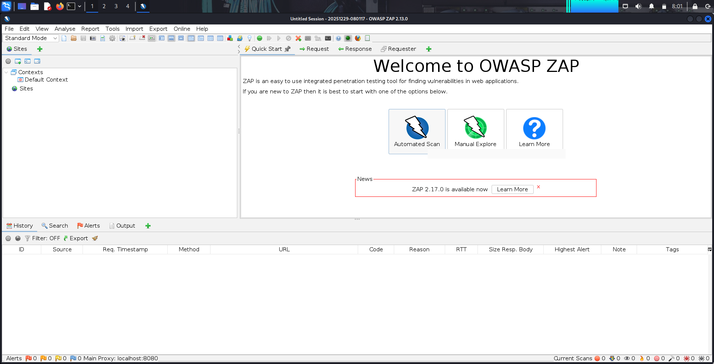
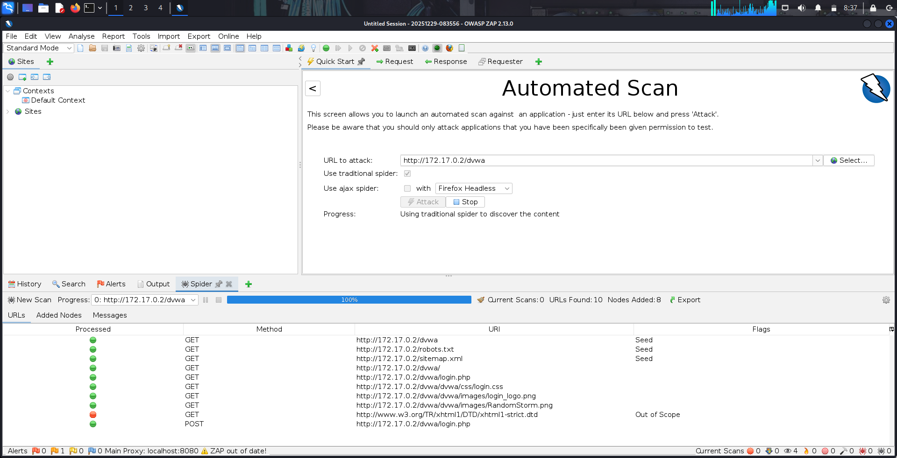
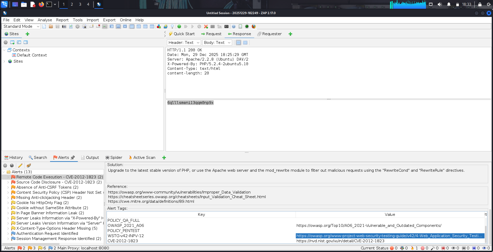
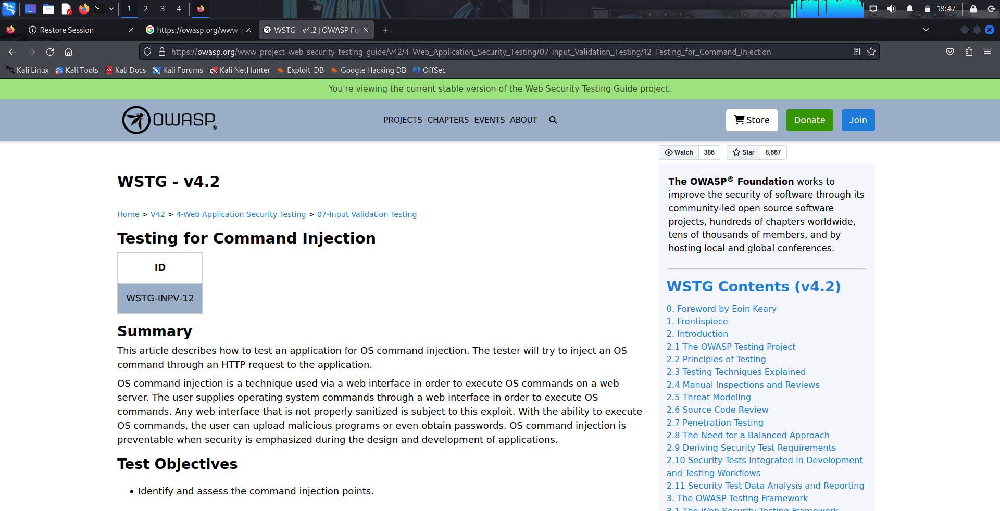

# Vulnerability Scan Workflow

## 1. Tool Initialization
The Kali Linux virtual machine was started, and OWASP ZAP was launched from the applications menu.

## 2. Automated Scanning
The Automated Scan feature in OWASP ZAP was used to assess the target application.

- Target URL entered: http://172.17.0.2/dvwa
- ZAP spidered the application to identify available resources
- Active scanning was performed against discovered endpoints

The full scan completed in under 10 minutes.

## 3. Results Review
After the scan completed, the **Alerts** tab was reviewed to analyze the identified vulnerabilities.

## Alert Summary
The following risk levels were observed:
- High
- Medium
- Low
- Informational

## Notable High-Risk Finding
- **Remote Code Execution – CVE-2012-1823**

This vulnerability was selected for deeper investigation due to its severity and potential impact.

---

# Vulnerability Analysis: Remote Code Execution (CVE-2012-1823)

## Description
CVE-2012-1823 is a Remote Code Execution vulnerability affecting PHP-CGI configurations.  
Improper handling of query string parameters allows attackers to pass command-line arguments directly to the PHP interpreter.

## Root Cause
- Insecure PHP-CGI configuration
- Lack of proper input validation and request handling

## Exploitation Method
An attacker can craft a malicious HTTP request containing specially formatted parameters.  
When processed by the PHP-CGI binary, these parameters may result in arbitrary system command execution on the server.

## Impact
- Complete compromise of the affected web server
- Unauthorized access to system resources
- Potential data exposure or service disruption

## WSTG Reference
This vulnerability aligns with OWASP Web Security Testing Guide (WSTG) testing areas related to **input validation and injection flaws**.

The WSTG provides structured testing methodologies, attack patterns, and validation techniques that assist penetration testers in identifying and confirming such vulnerabilities.

---

# Remediation Recommendations

## Immediate Actions
- Disable PHP-CGI if it is not required
- Apply the latest security patches to PHP
- Restrict execution of PHP scripts through secure server configuration

## Long-Term Mitigation
- Enforce strict input validation controls
- Implement a Web Application Firewall (WAF)
- Conduct routine vulnerability assessments
- Follow OWASP secure configuration and deployment best practices

## Security Note
Intentionally vulnerable applications such as DVWA should only be deployed in isolated lab environments and must never be used in production systems.
